# GitHub Streak & Stats Generator

Automated GitHub Action that tracks your **lifetime contribution data** (not just the last year) and generates **dynamic streak SVG images**.

---

## Theme Showcase

These stats are generated automatically every day.

<strong>Ocean Blue</strong>

<!-- Relative paths ensure these images load correctly on forks automatically -->

<strong>Emerald Forest</strong>

---

## How to Add This to Your Profile

You can easily add these stats to your **GitHub Profile README**.

---

## Step 1: Fork & Setup

1. Fork this repository to your own account.
2. Go to the **Actions** tab in your forked repo.
3. Click **"I understand my workflows, go ahead and enable them"**.
4. *(Optional)* Manually trigger the **"Update Streak Stats"** workflow once to generate your first set of images immediately.

---

## Step 2: Add to Your Profile

Copy the code below and paste it into your profile's `README.md`.

**Important:** Replace `YOUR_USERNAME` with your actual GitHub username.

---

### Option A: Markdown (Simple)

---

### Option B: HTML (Centered & Resizable)

  

---

## Configuration

- **Lifetime Stats:** Automatically detects your GitHub account creation date.
- **Update Frequency:** Updates daily at **Midnight UTC**.
- **Manual Trigger:** Can be triggered anytime from the **Actions** tab.

---

## Available Themes

Change the filename in the URL to switch themes:

- streak-ocean-blue-dark.svg
- streak-ocean-blue-light.svg
- streak-emerald-forest-dark.svg
- streak-mint-breeze-light.svg
